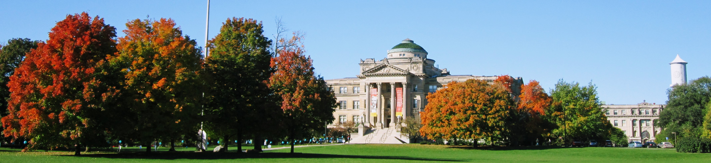

# Charles (Charlie) Labuzzetta

I am a PhD co-major student in statistics and environmental science at Iowa State University. My co-advisors are Dr. Zhengyuan Zhu (Department of Statistics) and Yuyu Zhou (Department of Geological and Atmospheric Sciences).

I recieve support from the Center for Survey Statistics and Methodology (CSSM) for my work as a research assistant and from the NSF DataFEWSion Traineeship program.

Research Interests
------------------

* Satellite image analysis
* Bayesian methods for spatial data
* Deep learning
* Landcover classification
* Best management practices for water pollution

Education
---------

* **PhD in Statistics**, Iowa State University 2022
* **BS in Mathematics**, Iowa State University 2017

Acknowledgements
----------------

* [Center for Survey Statistics and Methodology](https://www.cssm.iastate.edu/)
* [DataFEWSion Traineeship Program](https://www.imse.iastate.edu/datafewsion/)

